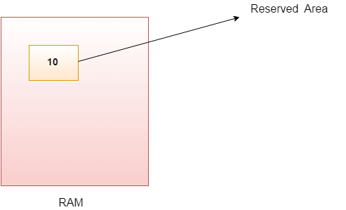

### Understanding Variables in Java



#### What is a Variable?

A variable in Java is a container that holds data that can be changed during the execution of a program. Each variable has a type, which determines the kind of data it can store, such as integers, floating-point numbers, characters, and more.

### Types of Variables

Java has several types of variables, categorized into two main groups:

1. **Primitive Data Types**
2. **Reference Data Types**

#### Primitive Data Types

These are the most basic data types in Java and include:

1. **`byte`**: 8-bit integer (-128 to 127)
2. **`short`**: 16-bit integer (-32,768 to 32,767)
3. **`int`**: 32-bit integer (-2^31 to 2^31-1)
4. **`long`**: 64-bit integer (-2^63 to 2^63-1)
5. **`float`**: Single-precision 32-bit floating point
6. **`double`**: Double-precision 64-bit floating point
7. **`char`**: Single 16-bit Unicode character
8. **`boolean`**: Represents `true` or `false`

**Example:**
```java
public class Main {
    public static void main(String[] args) {
        byte myByte = 100;
        short myShort = 1000;
        int myInt = 10000;
        long myLong = 100000L;
        float myFloat = 10.99f;
        double myDouble = 99.99;
        char myChar = 'A';
        boolean myBool = true;

        System.out.println("Byte: " + myByte);
        System.out.println("Short: " + myShort);
        System.out.println("Int: " + myInt);
        System.out.println("Long: " + myLong);
        System.out.println("Float: " + myFloat);
        System.out.println("Double: " + myDouble);
        System.out.println("Char: " + myChar);
        System.out.println("Boolean: " + myBool);
    }
}
```

#### Reference Data Types

These are used to refer to objects and include:

1. **Classes**
2. **Interfaces**
3. **Arrays**
4. **Strings** (although not a primitive, it is a frequently used reference type)

**Example:**
```java
public class Main {
    public static void main(String[] args) {
        String myString = "Hello, World!";
        int[] myArray = {1, 2, 3, 4, 5};

        System.out.println("String: " + myString);
        System.out.println("Array Element: " + myArray[0]);
    }
}
```

### Declaring and Initializing Variables

Variables in Java must be declared before they are used. Declaration involves specifying the data type and the variable name. Initialization assigns a value to the variable.

**Declaration:**
```java
int myNumber;
```

**Initialization:**
```java
myNumber = 10;
```

**Combined Declaration and Initialization:**
```java
int myNumber = 10;
```

### Variable Naming Rules

1. Must start with a letter, underscore `_`, or dollar sign `$`.
2. Subsequent characters can be letters, digits, underscores, or dollar signs.
3. Cannot be a reserved keyword (e.g., `int`, `class`, `public`).
4. Case-sensitive (`myNumber` and `mynumber` are different variables).

**Example:**
```java
public class Main {
    public static void main(String[] args) {
        int age = 25;
        double salary = 50000.75;
        boolean isEmployed = true;
        char grade = 'A';
        String name = "John Doe";

        System.out.println("Name: " + name);
        System.out.println("Age: " + age);
        System.out.println("Salary: " + salary);
        System.out.println("Employed: " + isEmployed);
        System.out.println("Grade: " + grade);
    }
}
```

### Scope of Variables

The scope of a variable determines where it can be accessed within a program:

1. **Local Variables**: Declared within a method or block and can only be used within that method or block.
2. **Instance Variables**: Declared within a class but outside any method. They are accessible by all methods in the class.
3. **Class Variables (Static Variables)**: Declared with the `static` keyword within a class but outside any method. They are shared among all instances of the class.

**Example:**
```java
public class Main {
    static int classVariable = 5; // Class variable

    int instanceVariable = 10; // Instance variable

    public void method() {
        int localVariable = 15; // Local variable
        System.out.println("Local Variable: " + localVariable);
        System.out.println("Instance Variable: " + instanceVariable);
        System.out.println("Class Variable: " + classVariable);
    }

    public static void main(String[] args) {
        Main obj = new Main();
        obj.method();
        System.out.println("Class Variable accessed from main: " + classVariable);
    }
}
```

### Practical Exercises

1. **Exercise 1:** Write a program that declares an integer variable, assigns it a value, and prints it.
```java
public class Main {
    public static void main(String[] args) {
        int number = 42;
        System.out.println("Number: " + number);
    }
}
```

2. **Exercise 2:** Write a program that declares variables of each primitive type, assigns them values, and prints them.
```java
public class Main {
    public static void main(String[] args) {
        byte byteVar = 127;
        short shortVar = 32767;
        int intVar = 2147483647;
        long longVar = 9223372036854775807L;
        float floatVar = 3.14f;
        double doubleVar = 3.14159;
        char charVar = 'J';
        boolean boolVar = true;

        System.out.println("byte: " + byteVar);
        System.out.println("short: " + shortVar);
        System.out.println("int: " + intVar);
        System.out.println("long: " + longVar);
        System.out.println("float: " + floatVar);
        System.out.println("double: " + doubleVar);
        System.out.println("char: " + charVar);
        System.out.println("boolean: " + boolVar);
    }
}
```

3. **Exercise 3:** Write a program that concatenates two strings and prints the result.
```java
public class Main {
    public static void main(String[] args) {
        String firstName = "John";
        String lastName = "Doe";
        String fullName = firstName + " " + lastName;

        System.out.println("Full Name: " + fullName);
    }
}
```

4. **Exercise 4:** Write a program that performs arithmetic operations on two numbers and prints the results.
```java
public class Main {
    public static void main(String[] args) {
        int a = 10;
        int b = 5;

        int sum = a + b;
        int difference = a - b;
        int product = a * b;
        int quotient = a / b;
        int remainder = a % b;

        System.out.println("Sum: " + sum);
        System.out.println("Difference: " + difference);
        System.out.println("Product: " + product);
        System.out.println("Quotient: " + quotient);
        System.out.println("Remainder: " + remainder);
    }
}
```

