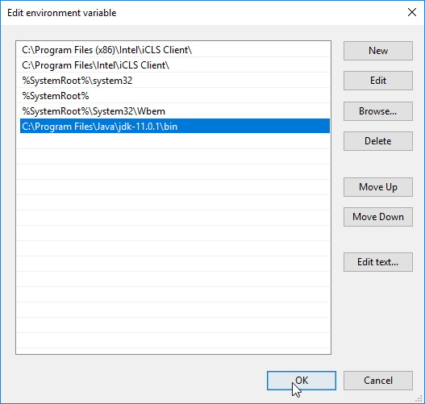

### 1. Install the Java Development Kit (JDK)
The JDK is necessary for developing, compiling, and running Java applications.

#### For Windows:
1. **Download the JDK:**
    - Visit the [Oracle JDK download page](https://www.oracle.com/java/technologies/javase-downloads.html) or use an open-source alternative like [OpenJDK](https://openjdk.java.net/).
    - Choose the appropriate version for your system and download the installer.

2. **Install the JDK:**
    - Run the downloaded installer and follow the on-screen instructions.
    - By default, the JDK is installed in `C:\Program Files\Java\jdk-version`.

#### For macOS:
1. **Download and Install the JDK:**
    - Visit the [Oracle JDK download page](https://www.oracle.com/java/technologies/javase-downloads.html) or [OpenJDK](https://openjdk.java.net/).
    - Download the macOS installer (usually a `.dmg` file).
    - Open the `.dmg` file and follow the instructions to install the JDK.

2. **Install via Homebrew (alternative method):**
    - If you use Homebrew, you can install OpenJDK using the command:
      ```bash
      brew install openjdk
      ```

#### For Linux:
1. **Install via Package Manager:**
    - For Debian-based systems (like Ubuntu), use:
      ```bash
      sudo apt update
      sudo apt install openjdk-17-jdk
      ```
    - For RPM-based systems (like Fedora), use:
      ```bash
      sudo dnf install java-17-openjdk
      ```

### 2. Configure Environment Variables
To make sure the system recognizes Java commands, set the `JAVA_HOME` environment variable and update the `PATH`.

#### For Windows:
1. **Set JAVA_HOME:**
    - Right-click on `This PC` or `Computer` on the desktop or in File Explorer, then click `Properties`.
    - Click on `Advanced system settings`, then `Environment Variables`.
    - In the `System variables` section, click `New` and add:
        - Variable name: `JAVA_HOME`
        - Variable value: Path to your JDK installation (e.g., `C:\Program Files\Java\jdk-version`).

2. **Update PATH:**
    - In the `System variables` section, find the `Path` variable, select it, and click `Edit`.
    - Add a new entry with the path to the `bin` directory of the JDK (e.g., `C:\Program Files\Java\jdk-version\bin`).

#### For macOS and Linux:
1. **Set JAVA_HOME and Update PATH:**
    - Open a terminal and edit your shell profile file (`.bashrc`, `.bash_profile`, `.zshrc`, etc.):
      ```bash
      nano ~/.bash_profile  # or ~/.zshrc for zsh
      ```
    - Add the following lines:
      ```bash
      export JAVA_HOME=/path/to/your/jdk
      export PATH=$JAVA_HOME/bin:$PATH
      ```
    - Replace `/path/to/your/jdk` with the actual path to your JDK installation.

2. **Apply the changes:**
   ```bash
   source ~/.bash_profile  # or ~/.zshrc for zsh
   ```

### 3. Verify the Installation
Open a terminal or command prompt and run:
```bash
java -version
javac -version
```
You should see the installed Java version.

### 4. Set Up an Integrated Development Environment (IDE)
Popular Java IDEs include IntelliJ IDEA, Eclipse, and NetBeans. Here’s how to set up IntelliJ IDEA:

#### IntelliJ IDEA:
1. **Download IntelliJ IDEA:**
    - Visit the [IntelliJ IDEA download page](https://www.jetbrains.com/idea/download/) and download the Community or Ultimate edition.

2. **Install IntelliJ IDEA:**
    - Run the installer and follow the on-screen instructions.

3. **Configure IntelliJ IDEA:**
    - Open IntelliJ IDEA.
    - Configure the JDK:
        - Go to `File` > `Project Structure` > `SDKs`.
        - Click the `+` icon and add your JDK installation path.

4. **Create a New Project:**
    - Click `Create New Project`.
    - Select `Java` and ensure the JDK is selected.
    - Follow the prompts to set up your new project.

### 5. Writing and Running a Simple Java Program
1. **Create a New Java Class:**
    - In your IDE, create a new Java class file (e.g., `HelloWorld.java`).

2. **Write the Code:**
   ```java
   public class HelloWorld {
       public static void main(String[] args) {
           System.out.println("Hello, World!");
       }
   }
   ```

3. **Run the Program:**
    - Use the IDE’s built-in run feature to execute the program.



