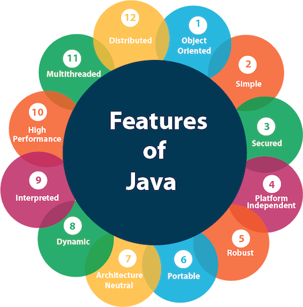

### Important Features of Java

1. **Object-Oriented**
    - **Definition:** Java is based on the Object-Oriented Programming (OOP) paradigm, which promotes the concept of objects that encapsulate data and behavior.
    - **Key Concepts:**
        - **Class and Object:** Fundamental building blocks. Classes define the structure and behavior of objects.
        - **Inheritance:** Mechanism to create a new class from an existing class.
        - **Polymorphism:** Ability to present the same interface for different data types.
        - **Encapsulation:** Bundling data with methods that operate on the data.
        - **Abstraction:** Hiding complex implementation details and showing only the necessary features.

2. **Platform Independent**
    - **Definition:** Java is designed to run on any device capable of running the Java Virtual Machine (JVM), following the principle of "Write Once, Run Anywhere" (WORA).
    - **Mechanism:** Java code is compiled into bytecode, which is platform-independent and interpreted by the JVM specific to each platform.

3. **Simple**
    - **Definition:** Java is designed to be easy to learn and use.
    - **Characteristics:**
        - **Syntax:** Clean and easy to understand.
        - **Removal of Complex Features:** No pointers, operator overloading, or multiple inheritance (as seen in C++).

4. **Secure**
    - **Definition:** Java provides a robust security framework to create virus-free, tamper-free systems.
    - **Features:**
        - **Bytecode Verification:** Ensures code adheres to Java’s security constraints.
        - **Security Manager:** Defines access policies for classes.
        - **Sandboxing:** Restricts Java applets from performing unauthorized operations.

5. **Robust**
    - **Definition:** Java emphasizes on early checking for possible errors, runtime checking, and eliminating error-prone situations.
    - **Features:**
        - **Exception Handling:** Mechanism to handle runtime errors.
        - **Memory Management:** Automatic garbage collection to manage memory allocation and deallocation.
        - **Type Checking:** Strict compile-time type checking.

6. **Multithreaded**
    - **Definition:** Java supports concurrent execution of two or more threads (lightweight processes) for maximum utilization of CPU.
    - **Features:**
        - **Thread Class and Runnable Interface:** Used to create and manage threads.
        - **Synchronization:** Ensures thread safety while accessing shared resources.

7. **Architecture-Neutral**
    - **Definition:** Java applications are not tied to any particular hardware or operating system.
    - **Mechanism:** The compiled bytecode can run on any device with the JVM.

8. **Interpreted and High Performance**
    - **Definition:** Java bytecode is interpreted on the fly to native machine instructions and is optimized for performance.
    - **Mechanism:** The Just-In-Time (JIT) compiler converts bytecode to native code at runtime, enhancing performance.

9. **Distributed**
    - **Definition:** Java is designed to support applications on networks.
    - **Features:**
        - **Remote Method Invocation (RMI):** Allows invoking methods on remote objects.
        - **Java Networking:** Extensive libraries for TCP/IP, UDP communication, and distributed computing.

10. **Dynamic**
    - **Definition:** Java is capable of dynamically linking new class libraries, methods, and objects.
    - **Mechanism:** Java programs carry extensive runtime information that can be used to verify and resolve accesses to objects at runtime.

11. **High Performance**
    - **Definition:** Java performance is improved through the use of the JIT compiler.
    - **Mechanism:** The JIT compiler translates Java bytecode into native machine code at runtime, enhancing execution speed.

12. **Versatile**
    - **Definition:** Java can be used for a wide range of applications, from desktop to web to mobile to enterprise applications.
    - **Frameworks and Tools:**
        - **Spring, Hibernate:** For enterprise applications.
        - **JavaFX:** For rich client applications.
        - **Android SDK:** For mobile applications.

